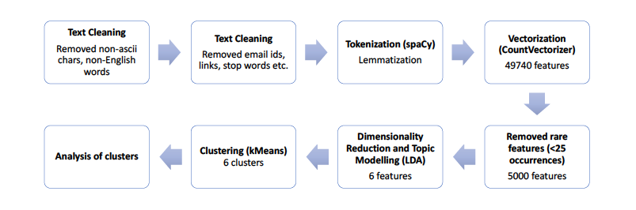

# NLP of kickstarter project descriptions

### Goal

Kickstarter, it is a global crowd funding platform where independent creators and passionate backers come together to bring new ideas to life. Creators can write in length about their projects, discussing their motivation, production plans, risks involved, etc. Backers impressed by the projects can pledge as low as $1 to mark their support for the project. Creators who are able to surpass their funding goal within the duration of their campaign can put their dreams to production with the support of the backers.

Kickstarter has defined 15 categories of projects i.e. Art, Comics, Crafts, Dance, Design, Fashion, Film & Video, Food, Games, Journalism, Music, Photography, Publishing, Technology, and Theater.

The objective is to using Natural Language Processing and Unsupervised Learning to analyze the the Kickstarter descriptions and to see whether

1. some new categories would emerge based on the language used
1. some categories would roll-up into some others

Given below is a flowchart describing the various steps taken to complete this project.

### Data Resources
The project descriptions were scraped from Kickstarter using Selenium. Although there are many online Kickstarer datasets available, none of them had the text of the projects descriptions. 

### Files included
1. 01 - Kickstart data.ipynb - Jupyter notebook consisting of the scraping of Kickstarter website.
1. 02 - Kickstarter NLP.ipynb - Jupyter notebook where the data is prepocessing and topics are modelled.

Also, you can click [here](https://jlakshmi235.github.io/project/2017/09/01/Metis-Language-of-Kickstarter.html) to find my blog post on this project.
